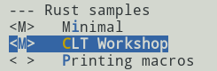
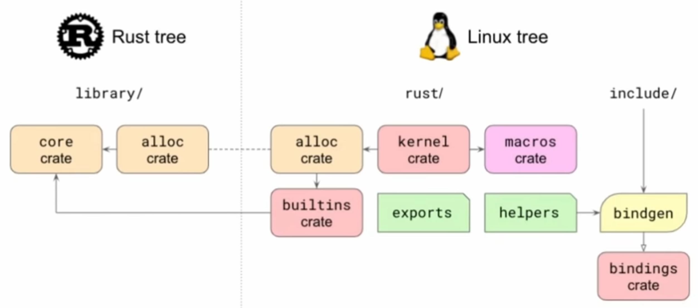
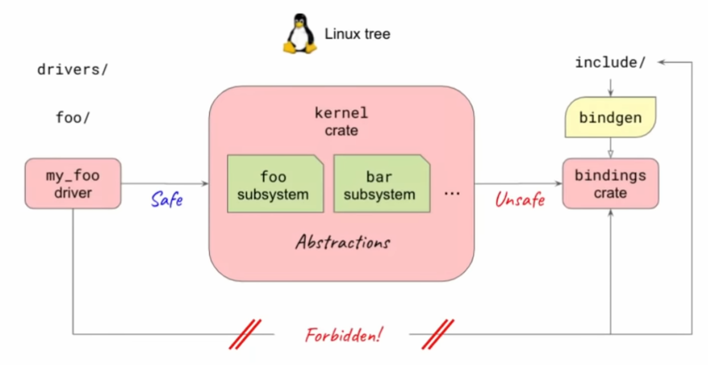
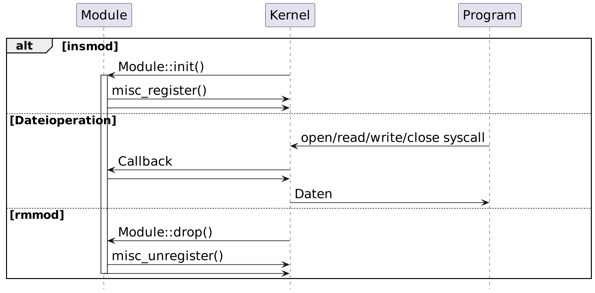
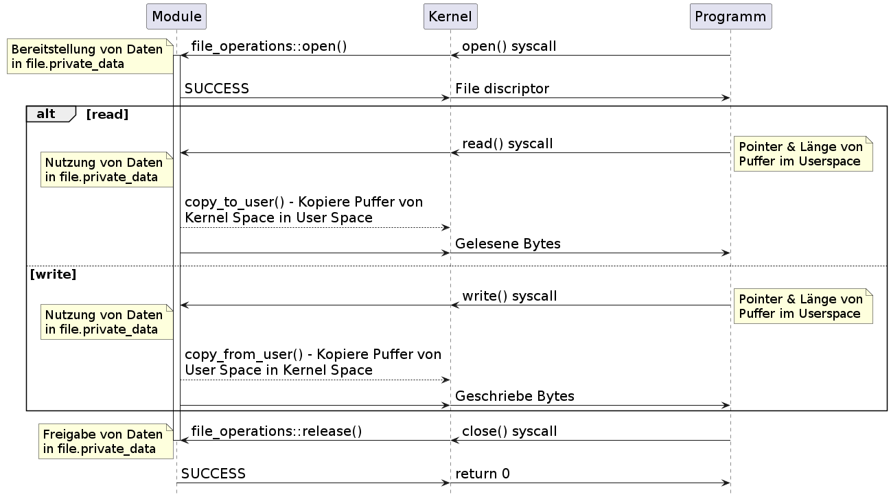
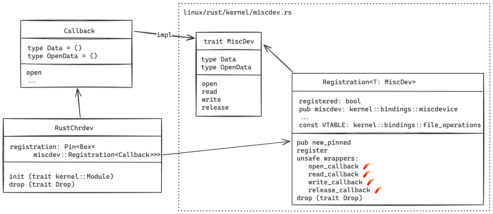

# Rust For Linux

Alexander Böhm & Antonia Siegert

Chemnitzer Linux Tage 2024

---

## Plan

* Tooling aufsetzen
* Linux Kernel kompilieren
* Eigenes Kernelmodul
* Kennenlernen der Rust-Integration
* Interaktion mit dem Modul

---

## Zu uns

---

### Alexander Böhm

* Softwareentwickler
* hauptsächlich Rust & Python
* Kein Kernel Maintainer
* Mehr Hobby-Projekt

---

### Antonia Siegert

* Softwareentwickler
* hauptsächlich C/C++ & Python
* Kein Kernel Maintainer

---

## Tooling aufsetzen

* git
* `docker` oder `podman`
* QEMU

---

### Notwendige Programme

```sh
# Debian/Ubuntu
apt-get install git podman qemu-system-x86
```

---

## Projekt

```sh
git clone \
    --depth 1 \
    --recurse-submodules \
    --shallow-submodules \
    https://github.com/aboehm/clt2024-rust-kernel-module.git
```

---

### Struktur

```text
├── build
│   ├── bzImage         -- Kernel
│   ├── initramfs       -- Minimales RootFS
│   └── initramfs.cpio  -- RAM-Dateisystem
├── docker              -- Container-Beschreibung
├── linux               -- Linux Kernel
├── linux-config        -- Kernel konfiguration
├── scripts             -- Skripte
└── slides              -- Vortragsfolien
```

---

## Vorbereitung

---

### Build-Umgebung

* Notwendige Tools enthalten
* Start [Container](https://hub.docker.com/r/aboehm/clt2024-rust-on-linux-workshop)

```sh
./scripts/enter-build-env
```

```text
root@localhost:/usr/src#
```

---

### Konfiguration

* Konfiguration kopieren

```sh
cp linux-config/v6.7-rust-clt24 linux/.config
```

-> Minimaler Kernel mit Rust-Unterstützung

---

### Kernel-Build

```sh
cd linux
```
* Kernel & Module kompilieren
```sh
make -j`nproc` LLVM=1 all
```
* Module kopieren
```sh
make LLVM=1 INSTALL_MOD_PATH=<Pfad zu initramfs> \
   modules_install
```

oder mit einem Skript

```sh
./scripts/build-kernel
```

---

### RootFS

* Dateisystem
* Initramfs
* `cpio`-Archiv
* Busybox
* Minimaler Init-Prozess
* Skript
  ```sh
  ./scripts/gen-initramfs
  ```

---

### Kernel starten

```sh
qemu-system-x86_64 \
    -monitor none -serial stdio \
    --vga none -display none \
    --kernel build/bzImage \
    --initrd build/initramfs.cpio \
    --append "console=ttyS0 debug"
```

---

### Alles in einem Schritt

```sh
./scripts/dev-cycle
```

* Baut Kernel & Module
* Generiert Initramfs neu
* Startet Kernel mit QEMU

---

## Das erste Modul

---

### Modul anlegen

Datei anlegen: `linux/samples/rust/rust_clt_workshop.rs`
```rust
// SPDX-License-Identifier: GPL-2.0

//! Rust module for CLT 2024

use kernel::prelude::*;
```

---

### Modul definieren

```rust
module! {
    type: RustCltModule,
    name: "rust_clt_workshop",
    author: "Alexander Böhm & Antonia Siegert",
    description: "Rust Module for CLT 2024",
    license: "GPL v2",
}

struct RustCltModule {}
```

---

### Loading

```rust
impl kernel::Module for RustCltModule {
    fn init(
        _module: &'static ThisModule
    ) -> Result<Self> {
        pr_info!("Hello CLT!");
        Ok(Self {})
    }
}
```

---

### Unloading

```rust
impl Drop for RustCltModule {
    fn drop(&mut self) {
        pr_info!("Goodbye CLT");
    }
}
```

---

### Kernel config erweitern

Option hinzufügen in: `samples/rust/Kconfig`

```text
config SAMPLE_RUST_CLT_WORKSHOP
	tristate "CLT Workshop"
	help
	  Simple Rust module for the workshop.

	  If unsure, say N.
```

---

### Build dependencies anpassen

Hinzufügen in:  `samples/rust/Makefile`

```
obj-$(CONFIG_SAMPLE_RUST_CLT_WORKSHOP) += rust_clt_workshop.o
```

---

### Modul aktivieren

```sh
cd linux
make LLVM=1 menuconfig
```
```text
Location:
  -> Kernel hacking
    -> Sample kernel code
      -> Rust samples
```


---

### Nach build nutzen

* Laden

```text { width.cutoff= 60 }
# insmod /lib/modules/6.7.0+/kernel/samples/rust/rust_clt_workshop.ko
[   15.361326] rust_clt_workshop: Hello CLT!
```

* Entladen

```text
# rmmod rust_clt_workshop
[   22.364618] rust_clt_workshop: Goodbye CLT!
```

---

## Breakout

- ~30min
- Ziel: Beispielmodul bauen und testen

---

## Rust Integration

---

### Rust kernel infrastructure



<small>

*Quelle: [Rust for Linux, Miguel Ojeda, Wedson Almeida Filho (März 2022)](https://www.youtube.com/watch?v=fVEeqo40IyQ&list=PL85XCvVPmGQgL3lqQD5ivLNLfdAdxbE_u)*

</small>

---

### Rust Basics

---

#### Speicherverwaltung

```C
size_t size = 1024;
char* buf = (char*) kmalloc(size, GFP_KERNEL);
memset(buf, 0, size);
// access buffer `buf`
kfree(buf);
```

```Rust
let mut buf = Vec::<u8>::try_with_capacity(1024)?;
buf.resize(0u8, buf.capacity());
// access buffer `buf`
drop(buf); // Optional durch Ownership
```

---

#### Listen

```C
struct my_list {
     struct list_head list;
     int data;
};
struct my_list* node = \
    kmalloc(sizeof(struct my_list), GFP_KERNEL);
node->data = 42;
INIT_LIST_HEAD(&node->list);
list_add_tail(&node->list, &Head);
struct my_list* i = NULL;
list_for_each_entry(i, &Head_Node, list) { ... }
list_del(node);
```

```Rust
let mut v = Vec::<i32>::new();
v.try_push(42)?;
for i in v.iter() { ... }
v.pop();
```

---

#### Mutex

```C
struct my_data {
    struct mutex lock;
    int value;
}
struct my_data data;
mutex_init(&data.lock);
mutex_lock(&data.lock);
my_data.value = 42; // Exklusive Operation
mutex_unlock(&data.lock);
```

```Rust
#[pin_data] // Benötigt für `pin_init!`
struct Data {
    #[pin]
    value: Mutex<u32>,
}
let data = pin_init!(Data { value <- new_mutex!(0), });
let data = Arc::pin_init(data).unwrap();
{
    *data.value.lock() = 42; // Exklusive Operation
    // Implizite Freigabe des Mutex
}
```

---

### Rust module design



<small>

*Quelle: [Rust for Linux, Miguel Ojeda, Wedson Almeida Filho (März 2022)](https://www.youtube.com/watch?v=fVEeqo40IyQ&list=PL85XCvVPmGQgL3lqQD5ivLNLfdAdxbE_u)*

</small>

---

#### Aktueller Status

* Basisfunktionen vorhanden<br>(Allocater, Logging, Locks)
* Wenige Rust-Abstraktionen seitens des Kernel
* Vereinzelte genutzte Funktionen
* Einige Out-Of-Tree Entwicklungen<br>(Asahi Linux, Google binder)

---

### Warum kein Out-Of-Tree Modul?

* Rust basiert auf LLVM
* Kernel muss mit *clang* gebaut werden
* Fehlende Funktionalitäten
  * PoC bei Rust-For-Linux für v5.19
  * Heutige Basis v6.7 => Patch

---

## Heutiges Ziel

* Erstellung eines Miscellaneous Device
* Character Device `/dev/rchrdev`
* Globaler Puffer
* Lesen und Schreiben auf Device

```sh
$ echo "Hello CLT" >/dev/rchrdev
$ cat /dev/rchrdev
Hello CLT
$
```

---

### Ausgangsbasis

* Kernel Tree v6.7
* Rust For Linux angelehnte Abstraktionssicht für Miscellaneous Device

---

### Notwendige Schnittstellen

<table>
<tr>
<td>Liste von Callbacks</td>
<td>

`struct file_operations`
</td>
</tr>
<tr>
<td>Information zum Device</td>
<td>

`struct miscdevice`
</td>
</tr>

<tr>
<td>
Device registrieren
</td>
<td>

`misc_register`
</td>
</tr>
<tr>
<td>
Device abmelden
</td>
<td>

`misc_unregister`
</td>
</tr>
</table>

---

#### Lebenzeit des Modules



---

#### Dateioperationen



---

### Rust Abstraktion



---

## Breakout

---

## Backup Folien

---

### Dokumentation bauen und lokal ansehen

```sh
./scripts/enter-build-env ./scripts/build-documentation
./scripts/enter-build-env ./scripts/serve-documentation
```
-> [http://127.0.0.1:8000/kernel](http://127.0.0.1:8000/kernel)

---

### Tooling ohne Container

```sh
curl --proto '=https' --tlsv1.2 -sSf https://sh.rustup.rs |sh

rustup toolchain install 1.73.0
cargo install --locked --version 0.65.1 bindgen-cli
rustup component add clippy rustfmt rust-src

apt-get update
apt-get install \
    build-essential gcc kmod \
    bc bison dwarves flex \
    libelf-dev libncurses-dev libssl-dev \
    clang clang-14 lld llvm llvm-14 zlib1g \
    busybox-static cpio \
    python3 \
    qemu-system-x86
```

---

### Links

* [Rust For Linux](https://rust-for-linux.com/)
* [Memory Layout (x86-64)](https://www.kernel.org/doc/Documentation/x86/x86_64/mm.txt)
